# System Flowcharts - LuckyAI 645
## 시스템 플로우차트 및 다이어그램

---

**문서 버전**: v1.0  
**작성일**: 2025-12-16  
**문서 유형**: Flowchart & Diagrams  
**프로젝트명**: LuckyAI 645

---

## 📋 목차

1. [사용자 플로우](#1-사용자-플로우)
2. [시스템 아키텍처](#2-시스템-아키텍처)
3. [데이터 플로우](#3-데이터-플로우)
4. [알고리즘 검증 프로세스](#4-알고리즘-검증-프로세스)
5. [백엔드 프로세스](#5-백엔드-프로세스)
6. [상태 다이어그램](#6-상태-다이어그램)
7. [시퀀스 다이어그램](#7-시퀀스-다이어그램)

---

## 1. 사용자 플로우

### 1.1 신규 사용자 온보딩 플로우

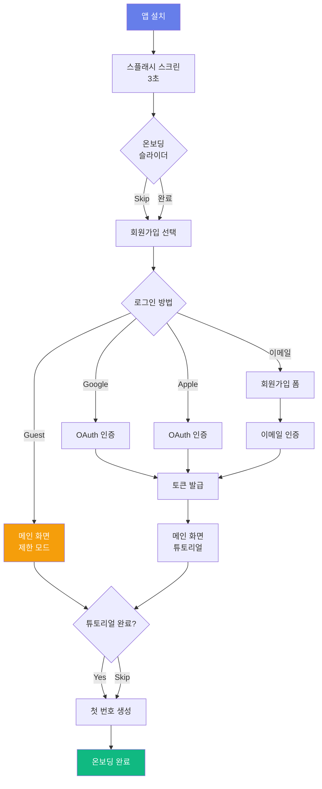
```mermaid
flowchart TD
    A[앱 설치] --> B[스플래시 스크린<br/>3초]
    B --> C{온보딩<br/>슬라이더}
    C -->|Skip| D[회원가입 선택]
    C -->|완료| D
    D --> E{로그인 방법}
    E -->|Guest| F[메인 화면<br/>제한 모드]
    E -->|이메일| G[회원가입 폼]
    E -->|Google| H[OAuth 인증]
    E -->|Apple| I[OAuth 인증]
    G --> J[이메일 인증]
    H --> K[토큰 발급]
    I --> K
    J --> K
    K --> L[메인 화면<br/>튜토리얼]
    F --> M{튜토리얼 완료?}
    L --> M
    M -->|Yes| N[첫 번호 생성]
    M -->|Skip| N
    N --> O[온보딩 완료]
    
    style A fill:#667eea,color:#fff
    style O fill:#10b981,color:#fff
    style F fill:#f59e0b,color:#fff
```

---

### 1.2 번호 생성 플로우

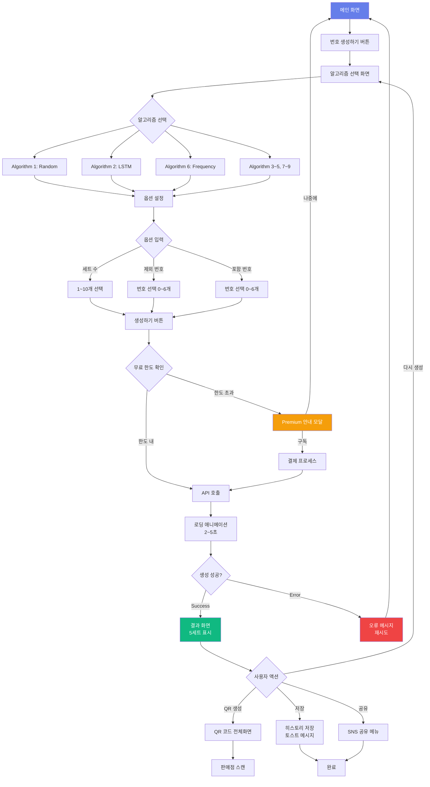
```mermaid
flowchart TD
    A[메인 화면] --> B[번호 생성하기 버튼]
    B --> C[알고리즘 선택 화면]
    C --> D{알고리즘 선택}
    D --> E[Algorithm 1: Random]
    D --> F[Algorithm 2: LSTM]
    D --> G[Algorithm 6: Frequency]
    D --> H[Algorithm 3~5, 7~9]
    E --> I[옵션 설정]
    F --> I
    G --> I
    H --> I
    I --> J{옵션 입력}
    J -->|세트 수| K[1~10개 선택]
    J -->|제외 번호| L[번호 선택 0~6개]
    J -->|포함 번호| M[번호 선택 0~6개]
    K --> N[생성하기 버튼]
    L --> N
    M --> N
    N --> O{무료 한도 확인}
    O -->|한도 내| P[API 호출]
    O -->|한도 초과| Q[Premium 안내 모달]
    Q -->|구독| R[결제 프로세스]
    Q -->|나중에| A
    R --> P
    P --> S[로딩 애니메이션<br/>2~5초]
    S --> T{생성 성공?}
    T -->|Success| U[결과 화면<br/>5세트 표시]
    T -->|Error| V[오류 메시지<br/>재시도]
    V --> A
    U --> W{사용자 액션}
    W -->|QR 생성| X[QR 코드 전체화면]
    W -->|저장| Y[히스토리 저장<br/>토스트 메시지]
    W -->|공유| Z[SNS 공유 메뉴]
    W -->|다시 생성| C
    X --> AA[판매점 스캔]
    Y --> AB[완료]
    Z --> AB
    
    style A fill:#667eea,color:#fff
    style U fill:#10b981,color:#fff
    style Q fill:#f59e0b,color:#fff
    style V fill:#ef4444,color:#fff
```

---

### 1.3 당첨 확인 플로우

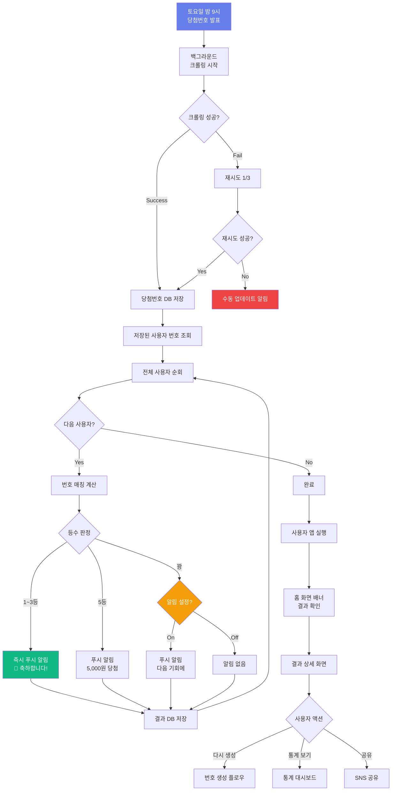
```mermaid
flowchart TD
    A[토요일 밤 9시<br/>당첨번호 발표] --> B[백그라운드<br/>크롤링 시작]
    B --> C{크롤링 성공?}
    C -->|Success| D[당첨번호 DB 저장]
    C -->|Fail| E[재시도 1/3]
    E --> F{재시도 성공?}
    F -->|Yes| D
    F -->|No| G[수동 업데이트 알림]
    D --> H[저장된 사용자 번호 조회]
    H --> I[전체 사용자 순회]
    I --> J{다음 사용자?}
    J -->|Yes| K[번호 매칭 계산]
    J -->|No| L[완료]
    K --> M{등수 판정}
    M -->|1~3등| N[즉시 푸시 알림<br/>🎉 축하합니다!]
    M -->|5등| O[푸시 알림<br/>5,000원 당첨]
    M -->|꽝| P{알림 설정?}
    P -->|On| Q[푸시 알림<br/>다음 기회에]
    P -->|Off| R[알림 없음]
    N --> S[결과 DB 저장]
    O --> S
    Q --> S
    R --> S
    S --> I
    L --> T[사용자 앱 실행]
    T --> U[홈 화면 배너<br/>결과 확인]
    U --> V[결과 상세 화면]
    V --> W{사용자 액션}
    W -->|다시 생성| X[번호 생성 플로우]
    W -->|통계 보기| Y[통계 대시보드]
    W -->|공유| Z[SNS 공유]
    
    style A fill:#667eea,color:#fff
    style N fill:#10b981,color:#fff
    style G fill:#ef4444,color:#fff
    style P fill:#f59e0b,color:#fff
```

---

### 1.4 구독 전환 플로우

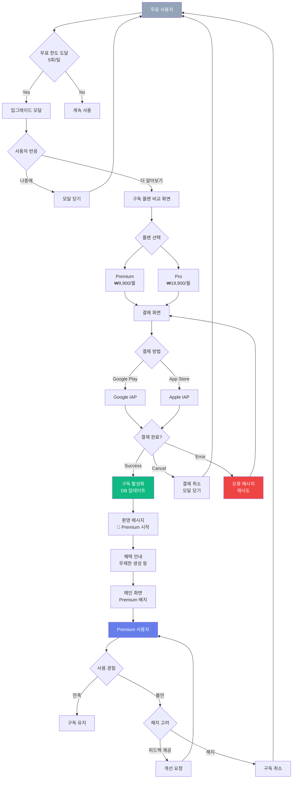
```mermaid
flowchart TD
    A[무료 사용자] --> B{무료 한도 도달<br/>5회/일}
    B -->|Yes| C[업그레이드 모달]
    B -->|No| D[계속 사용]
    C --> E{사용자 반응}
    E -->|나중에| F[모달 닫기]
    E -->|더 알아보기| G[구독 플랜 비교 화면]
    F --> A
    G --> H{플랜 선택}
    H --> I[Premium<br/>₩9,900/월]
    H --> J[Pro<br/>₩19,900/월]
    I --> K[결제 화면]
    J --> K
    K --> L{결제 방법}
    L -->|Google Play| M[Google IAP]
    L -->|App Store| N[Apple IAP]
    M --> O{결제 완료?}
    N --> O
    O -->|Success| P[구독 활성화<br/>DB 업데이트]
    O -->|Cancel| Q[결제 취소<br/>모달 닫기]
    O -->|Error| R[오류 메시지<br/>재시도]
    Q --> A
    R --> K
    P --> S[환영 메시지<br/>🎉 Premium 시작]
    S --> T[혜택 안내<br/>무제한 생성 등]
    T --> U[메인 화면<br/>Premium 배지]
    U --> V[Premium 사용자]
    V --> W{사용 경험}
    W -->|만족| X[구독 유지]
    W -->|불만| Y{해지 고려}
    Y -->|피드백 제공| Z[개선 요청]
    Y -->|해지| AA[구독 취소]
    Z --> V
    AA --> A
    
    style A fill:#94a3b8,color:#fff
    style V fill:#667eea,color:#fff
    style P fill:#10b981,color:#fff
    style R fill:#ef4444,color:#fff
```

---

## 2. 시스템 아키텍처

### 2.1 전체 시스템 아키텍처

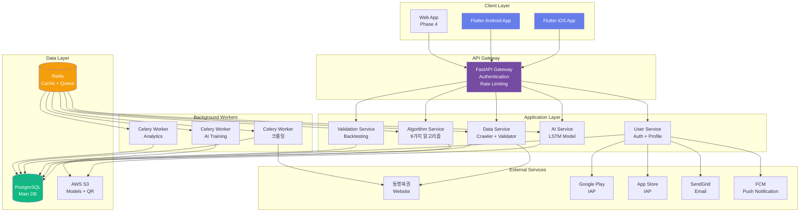
```mermaid
graph TB
    subgraph "Client Layer"
        A1[Flutter iOS App]
        A2[Flutter Android App]
        A3[Web App<br/>Phase 4]
    end
    
    subgraph "API Gateway"
        B[FastAPI Gateway<br/>Authentication<br/>Rate Limiting]
    end
    
    subgraph "Application Layer"
        C1[Algorithm Service<br/>9가지 알고리즘]
        C2[AI Service<br/>LSTM Model]
        C3[Data Service<br/>Crawler + Validator]
        C4[User Service<br/>Auth + Profile]
        C5[Validation Service<br/>Backtesting]
    end
    
    subgraph "Background Workers"
        D1[Celery Worker<br/>크롤링]
        D2[Celery Worker<br/>AI Training]
        D3[Celery Worker<br/>Analytics]
    end
    
    subgraph "Data Layer"
        E1[(PostgreSQL<br/>Main DB)]
        E2[(Redis<br/>Cache + Queue)]
        E3[AWS S3<br/>Models + QR]
    end
    
    subgraph "External Services"
        F1[동행복권<br/>Website]
        F2[Google Play<br/>IAP]
        F3[App Store<br/>IAP]
        F4[SendGrid<br/>Email]
        F5[FCM<br/>Push Notification]
    end
    
    A1 --> B
    A2 --> B
    A3 --> B
    B --> C1
    B --> C2
    B --> C3
    B --> C4
    B --> C5
    C1 --> E1
    C2 --> E3
    C3 --> E1
    C3 --> F1
    C4 --> E1
    C5 --> E1
    D1 --> E1
    D1 --> F1
    D2 --> E3
    D3 --> E1
    E2 --> C1
    E2 --> C2
    E2 --> C3
    E2 --> D1
    E2 --> D2
    E2 --> D3
    C4 --> F2
    C4 --> F3
    C4 --> F4
    C4 --> F5
    
    style A1 fill:#667eea,color:#fff
    style A2 fill:#667eea,color:#fff
    style B fill:#764ba2,color:#fff
    style E1 fill:#10b981,color:#fff
    style E2 fill:#f59e0b,color:#fff
```

---

### 2.2 마이크로서비스 아키텍처 (선택적)

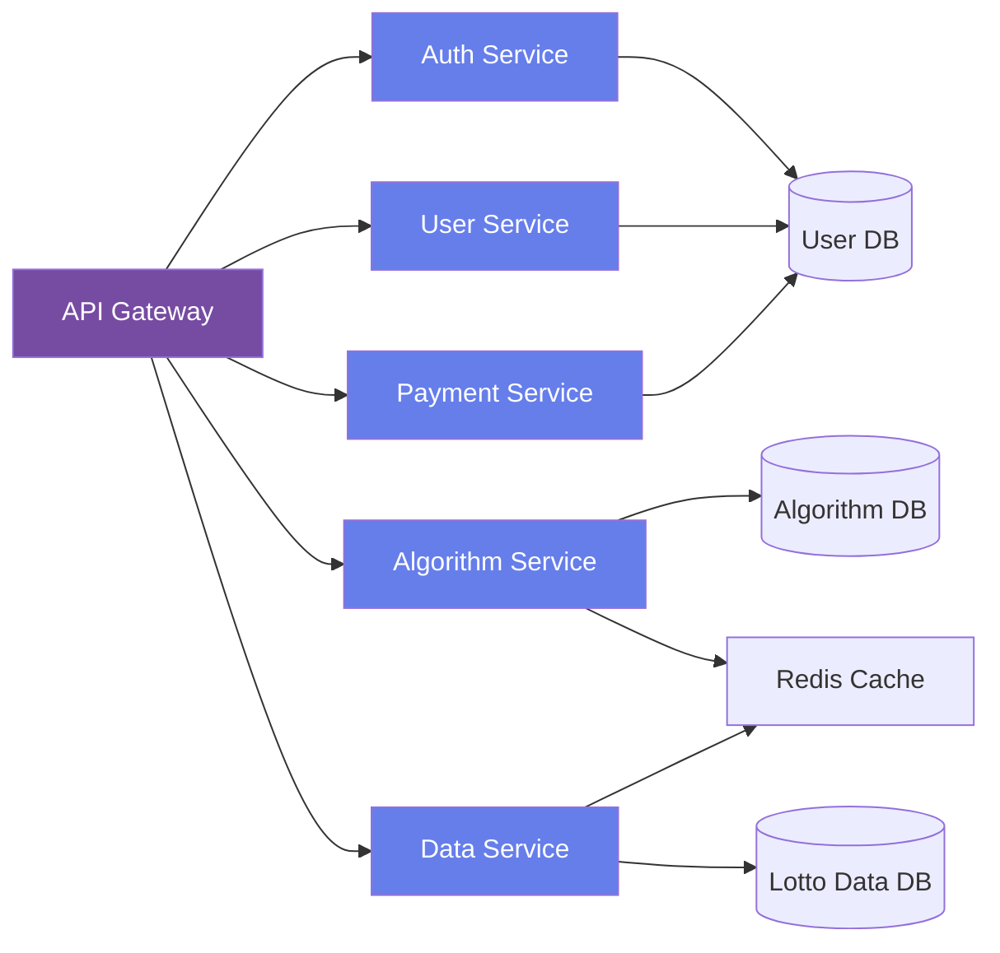
```mermaid
graph LR
    A[API Gateway] --> B[Auth Service]
    A --> C[Algorithm Service]
    A --> D[Data Service]
    A --> E[User Service]
    A --> F[Payment Service]
    
    B --> G[(User DB)]
    C --> H[(Algorithm DB)]
    D --> I[(Lotto Data DB)]
    E --> G
    F --> G
    
    C --> J[Redis Cache]
    D --> J
    
    style A fill:#764ba2,color:#fff
    style B fill:#667eea,color:#fff
    style C fill:#667eea,color:#fff
    style D fill:#667eea,color:#fff
    style E fill:#667eea,color:#fff
    style F fill:#667eea,color:#fff
```

---

### 2.3 배포 아키텍처

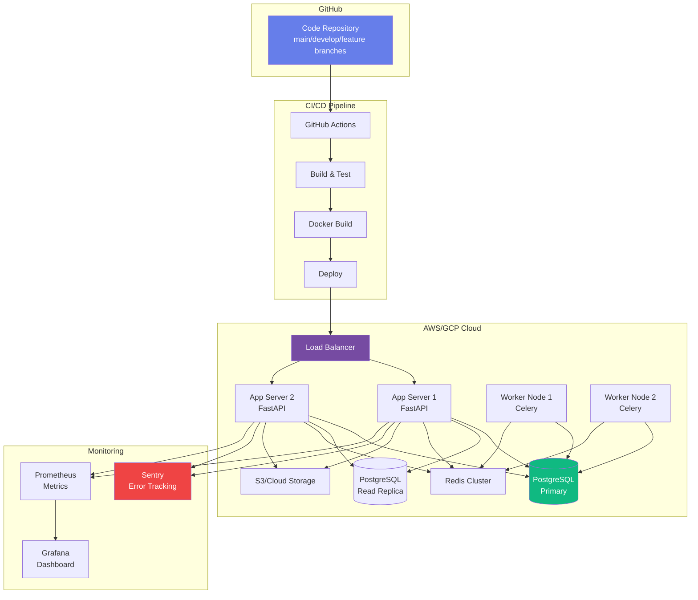
```mermaid
graph TB
    subgraph "GitHub"
        A[Code Repository<br/>main/develop/feature branches]
    end
    
    subgraph "CI/CD Pipeline"
        B[GitHub Actions]
        C[Build & Test]
        D[Docker Build]
        E[Deploy]
    end
    
    subgraph "AWS/GCP Cloud"
        F[Load Balancer]
        G[App Server 1<br/>FastAPI]
        H[App Server 2<br/>FastAPI]
        I[Worker Node 1<br/>Celery]
        J[Worker Node 2<br/>Celery]
        K[(PostgreSQL<br/>Primary)]
        L[(PostgreSQL<br/>Read Replica)]
        M[Redis Cluster]
        N[S3/Cloud Storage]
    end
    
    subgraph "Monitoring"
        O[Sentry<br/>Error Tracking]
        P[Prometheus<br/>Metrics]
        Q[Grafana<br/>Dashboard]
    end
    
    A --> B
    B --> C
    C --> D
    D --> E
    E --> F
    F --> G
    F --> H
    G --> K
    H --> K
    G --> L
    H --> L
    I --> K
    J --> K
    G --> M
    H --> M
    I --> M
    J --> M
    G --> N
    H --> N
    G --> O
    H --> O
    G --> P
    H --> P
    P --> Q
    
    style A fill:#667eea,color:#fff
    style F fill:#764ba2,color:#fff
    style K fill:#10b981,color:#fff
    style O fill:#ef4444,color:#fff
```

---

## 3. 데이터 플로우

### 3.1 번호 생성 데이터 플로우

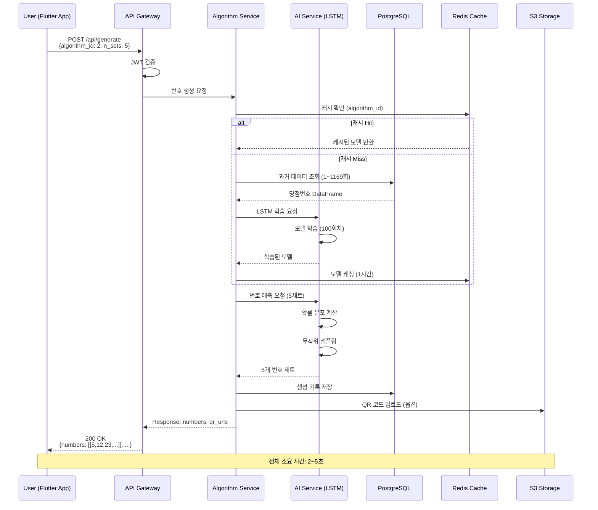
```mermaid
sequenceDiagram
    participant U as User (Flutter App)
    participant G as API Gateway
    participant AS as Algorithm Service
    participant AI as AI Service (LSTM)
    participant DB as PostgreSQL
    participant R as Redis Cache
    participant S3 as S3 Storage
    
    U->>G: POST /api/generate<br/>{algorithm_id: 2, n_sets: 5}
    G->>G: JWT 검증
    G->>AS: 번호 생성 요청
    AS->>R: 캐시 확인 (algorithm_id)
    alt 캐시 Hit
        R-->>AS: 캐시된 모델 반환
    else 캐시 Miss
        AS->>DB: 과거 데이터 조회 (1~1169회)
        DB-->>AS: 당첨번호 DataFrame
        AS->>AI: LSTM 학습 요청
        AI->>AI: 모델 학습 (100회차)
        AI-->>AS: 학습된 모델
        AS->>R: 모델 캐싱 (1시간)
    end
    AS->>AI: 번호 예측 요청 (5세트)
    AI->>AI: 확률 분포 계산
    AI->>AI: 무작위 샘플링
    AI-->>AS: 5개 번호 세트
    AS->>DB: 생성 기록 저장
    AS->>S3: QR 코드 업로드 (옵션)
    AS-->>G: Response: numbers, qr_urls
    G-->>U: 200 OK<br/>{numbers: [[5,12,23,...]], ...}
    
    Note over U,S3: 전체 소요 시간: 2~5초
```

---

### 3.2 당첨번호 크롤링 데이터 플로우

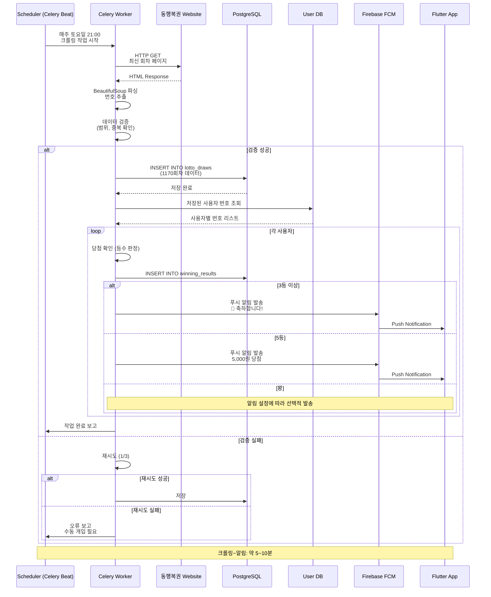
```mermaid
sequenceDiagram
    participant S as Scheduler (Celery Beat)
    participant W as Celery Worker
    participant WEB as 동행복권 Website
    participant DB as PostgreSQL
    participant U as User DB
    participant FCM as Firebase FCM
    participant APP as Flutter App
    
    S->>W: 매주 토요일 21:00<br/>크롤링 작업 시작
    W->>WEB: HTTP GET<br/>최신 회차 페이지
    WEB-->>W: HTML Response
    W->>W: BeautifulSoup 파싱<br/>번호 추출
    W->>W: 데이터 검증<br/>(범위, 중복 확인)
    alt 검증 성공
        W->>DB: INSERT INTO lotto_draws<br/>(1170회차 데이터)
        DB-->>W: 저장 완료
        W->>U: 저장된 사용자 번호 조회
        U-->>W: 사용자별 번호 리스트
        loop 각 사용자
            W->>W: 당첨 확인 (등수 판정)
            W->>DB: INSERT INTO winning_results
            alt 3등 이상
                W->>FCM: 푸시 알림 발송<br/>🎉 축하합니다!
                FCM->>APP: Push Notification
            else 5등
                W->>FCM: 푸시 알림 발송<br/>5,000원 당첨
                FCM->>APP: Push Notification
            else 꽝
                Note over W,APP: 알림 설정에 따라 선택적 발송
            end
        end
        W->>S: 작업 완료 보고
    else 검증 실패
        W->>W: 재시도 (1/3)
        alt 재시도 성공
            W->>DB: 저장
        else 재시도 실패
            W->>S: 오류 보고<br/>수동 개입 필요
        end
    end
    
    Note over S,APP: 크롤링~알림: 약 5~10분
```

---

### 3.3 알고리즘 검증 데이터 플로우

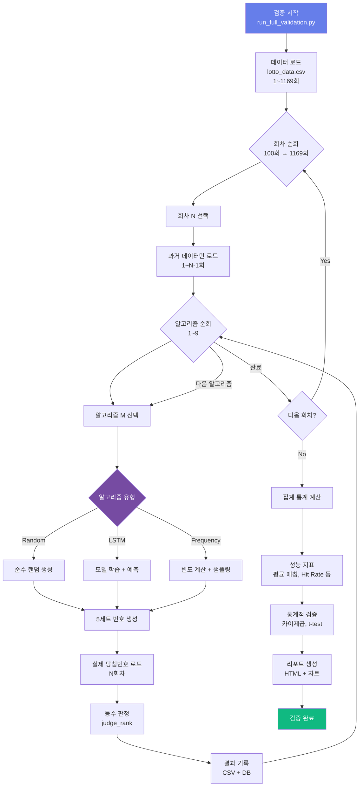
```mermaid
flowchart TD
    A[검증 시작<br/>run_full_validation.py] --> B[데이터 로드<br/>lotto_data.csv<br/>1~1169회]
    B --> C{회차 순회<br/>100회 → 1169회}
    C --> D[회차 N 선택]
    D --> E[과거 데이터만 로드<br/>1~N-1회]
    E --> F{알고리즘 순회<br/>1~9}
    F --> G[알고리즘 M 선택]
    G --> H{알고리즘 유형}
    H -->|Random| I[순수 랜덤 생성]
    H -->|LSTM| J[모델 학습 + 예측]
    H -->|Frequency| K[빈도 계산 + 샘플링]
    I --> L[5세트 번호 생성]
    J --> L
    K --> L
    L --> M[실제 당첨번호 로드<br/>N회차]
    M --> N[등수 판정<br/>judge_rank]
    N --> O[결과 기록<br/>CSV + DB]
    O --> F
    F -->|다음 알고리즘| G
    F -->|완료| P{다음 회차?}
    P -->|Yes| C
    P -->|No| Q[집계 통계 계산]
    Q --> R[성능 지표<br/>평균 매칭, Hit Rate 등]
    R --> S[통계적 검증<br/>카이제곱, t-test]
    S --> T[리포트 생성<br/>HTML + 차트]
    T --> U[검증 완료]
    
    style A fill:#667eea,color:#fff
    style U fill:#10b981,color:#fff
    style H fill:#764ba2,color:#fff
```

---

## 4. 알고리즘 검증 프로세스

### 4.1 Walk-Forward Validation 프로세스

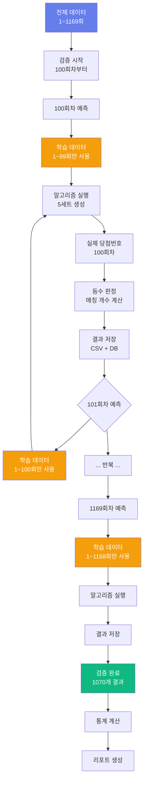
```mermaid
graph TD
    A[전체 데이터<br/>1~1169회] --> B[검증 시작<br/>100회차부터]
    B --> C[100회차 예측]
    C --> D[학습 데이터<br/>1~99회만 사용]
    D --> E[알고리즘 실행<br/>5세트 생성]
    E --> F[실제 당첨번호<br/>100회차]
    F --> G[등수 판정<br/>매칭 개수 계산]
    G --> H[결과 저장<br/>CSV + DB]
    H --> I{101회차 예측}
    I --> J[학습 데이터<br/>1~100회만 사용]
    J --> E
    I --> K[... 반복 ...]
    K --> L[1169회차 예측]
    L --> M[학습 데이터<br/>1~1168회만 사용]
    M --> N[알고리즘 실행]
    N --> O[결과 저장]
    O --> P[검증 완료<br/>1070개 결과]
    P --> Q[통계 계산]
    Q --> R[리포트 생성]
    
    style A fill:#667eea,color:#fff
    style D fill:#f59e0b,color:#fff
    style J fill:#f59e0b,color:#fff
    style M fill:#f59e0b,color:#fff
    style P fill:#10b981,color:#fff
```

---

### 4.2 알고리즘 실행 프로세스 (LSTM 예시)

```mermaid
flowchart TD
    A[입력: 과거 데이터<br/>1~99회] --> B[데이터 전처리<br/>원-핫 인코딩]
    B --> C[Sliding Window<br/>크기: 100]
    C --> D[학습 데이터 생성<br/>X, y]
    D --> E[LSTM 모델 초기화<br/>hidden_size: 128<br/>num_layers: 2]
    E --> F[학습 시작<br/>epochs: 20]
    F --> G{Epoch 반복}
    G --> H[Forward Pass]
    H --> I[Loss 계산<br/>BCE Loss]
    I --> J[Backward Pass]
    J --> K[Optimizer Step<br/>Adam, lr: 0.001]
    K --> G
    G -->|완료| L[학습 완료 모델]
    L --> M[마지막 시퀀스 입력<br/>90~99회]
    M --> N[Forward Pass]
    N --> O[출력: 확률 분포<br/>45개 번호]
    O --> P[Softmax 적용]
    P --> Q[무작위 샘플링<br/>6개 선택]
    Q --> R[정렬]
    R --> S{N세트 생성?}
    S -->|No| Q
    S -->|Yes| T[5세트 완성<br/>[[5,12,23,...], ...]
    T --> U[반환]
    
    style A fill:#667eea,color:#fff
    style T fill:#10b981,color:#fff
    style F fill:#f59e0b,color:#fff
```

---

### 4.3 성능 지표 계산 프로세스

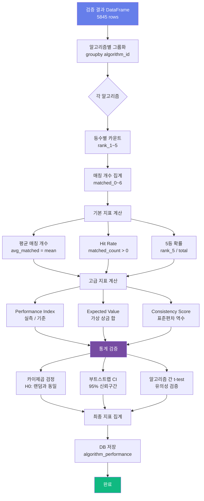
```mermaid
flowchart TD
    A[검증 결과 DataFrame<br/>5845 rows] --> B[알고리즘별 그룹화<br/>groupby algorithm_id]
    B --> C{각 알고리즘}
    C --> D[등수별 카운트<br/>rank_1~5]
    D --> E[매칭 개수 집계<br/>matched_0~6]
    E --> F[기본 지표 계산]
    F --> G[평균 매칭 개수<br/>avg_matched = mean]
    F --> H[Hit Rate<br/>matched_count > 0]
    F --> I[5등 확률<br/>rank_5 / total]
    G --> J[고급 지표 계산]
    H --> J
    I --> J
    J --> K[Performance Index<br/>실측 / 기준]
    J --> L[Expected Value<br/>가상 상금 합]
    J --> M[Consistency Score<br/>표준편차 역수]
    K --> N[통계 검증]
    L --> N
    M --> N
    N --> O[카이제곱 검정<br/>H0: 랜덤과 동일]
    N --> P[부트스트랩 CI<br/>95% 신뢰구간]
    N --> Q[알고리즘 간 t-test<br/>유의성 검증]
    O --> R[최종 지표 집계]
    P --> R
    Q --> R
    R --> S[DB 저장<br/>algorithm_performance]
    S --> T[완료]
    
    style A fill:#667eea,color:#fff
    style T fill:#10b981,color:#fff
    style N fill:#764ba2,color:#fff
```

---

## 5. 백엔드 프로세스

### 5.1 API 요청 처리 프로세스

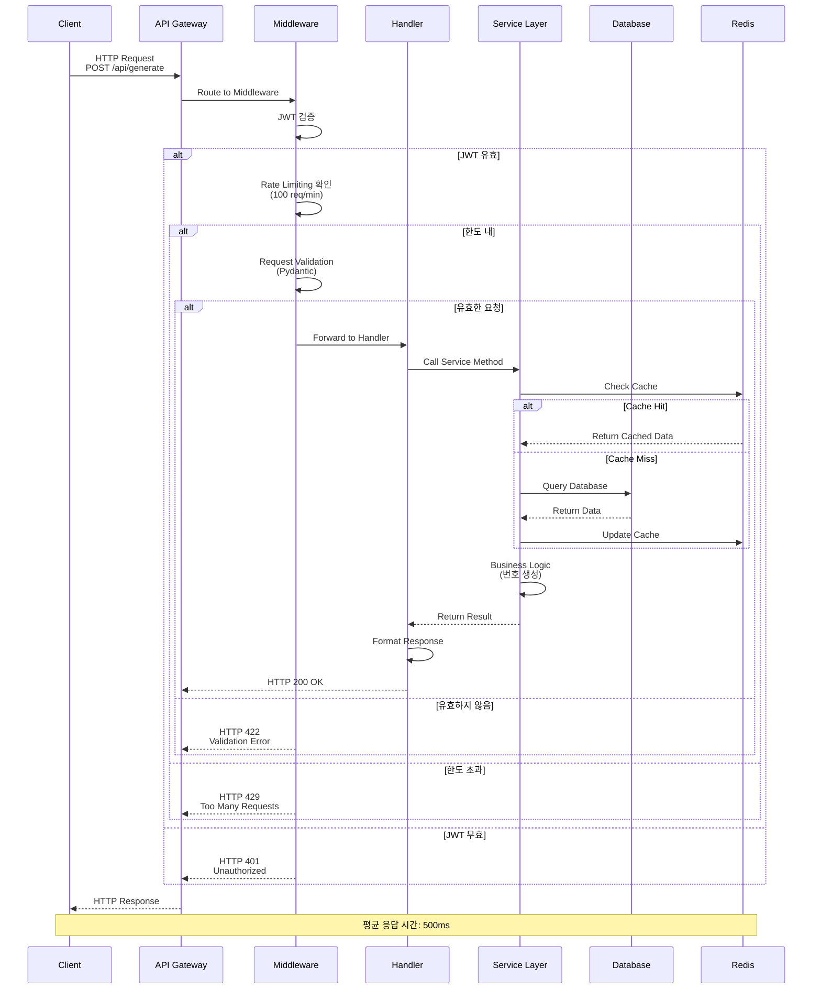
```mermaid
sequenceDiagram
    participant C as Client
    participant G as API Gateway
    participant M as Middleware
    participant H as Handler
    participant S as Service Layer
    participant DB as Database
    participant R as Redis
    
    C->>G: HTTP Request<br/>POST /api/generate
    G->>M: Route to Middleware
    M->>M: JWT 검증
    alt JWT 유효
        M->>M: Rate Limiting 확인<br/>(100 req/min)
        alt 한도 내
            M->>M: Request Validation<br/>(Pydantic)
            alt 유효한 요청
                M->>H: Forward to Handler
                H->>S: Call Service Method
                S->>R: Check Cache
                alt Cache Hit
                    R-->>S: Return Cached Data
                else Cache Miss
                    S->>DB: Query Database
                    DB-->>S: Return Data
                    S->>R: Update Cache
                end
                S->>S: Business Logic<br/>(번호 생성)
                S-->>H: Return Result
                H->>H: Format Response
                H-->>G: HTTP 200 OK
            else 유효하지 않음
                M-->>G: HTTP 422<br/>Validation Error
            end
        else 한도 초과
            M-->>G: HTTP 429<br/>Too Many Requests
        end
    else JWT 무효
        M-->>G: HTTP 401<br/>Unauthorized
    end
    G-->>C: HTTP Response
    
    Note over C,R: 평균 응답 시간: 500ms
```

---

### 5.2 백그라운드 작업 프로세스 (Celery)

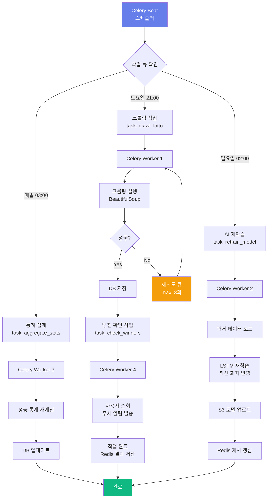
```mermaid
flowchart TD
    A[Celery Beat<br/>스케줄러] --> B{작업 큐 확인}
    B -->|토요일 21:00| C[크롤링 작업<br/>task: crawl_lotto]
    B -->|일요일 02:00| D[AI 재학습<br/>task: retrain_model]
    B -->|매일 03:00| E[통계 집계<br/>task: aggregate_stats]
    C --> F[Celery Worker 1]
    D --> G[Celery Worker 2]
    E --> H[Celery Worker 3]
    F --> I[크롤링 실행<br/>BeautifulSoup]
    I --> J{성공?}
    J -->|Yes| K[DB 저장]
    J -->|No| L[재시도 큐<br/>max: 3회]
    L --> F
    K --> M[당첨 확인 작업<br/>task: check_winners]
    M --> N[Celery Worker 4]
    N --> O[사용자 순회<br/>푸시 알림 발송]
    O --> P[작업 완료<br/>Redis 결과 저장]
    G --> Q[과거 데이터 로드]
    Q --> R[LSTM 재학습<br/>최신 회차 반영]
    R --> S[S3 모델 업로드]
    S --> T[Redis 캐시 갱신]
    H --> U[성능 통계 재계산]
    U --> V[DB 업데이트]
    V --> W[완료]
    P --> W
    T --> W
    
    style A fill:#667eea,color:#fff
    style W fill:#10b981,color:#fff
    style L fill:#f59e0b,color:#fff
```

---

### 5.3 결제 처리 프로세스

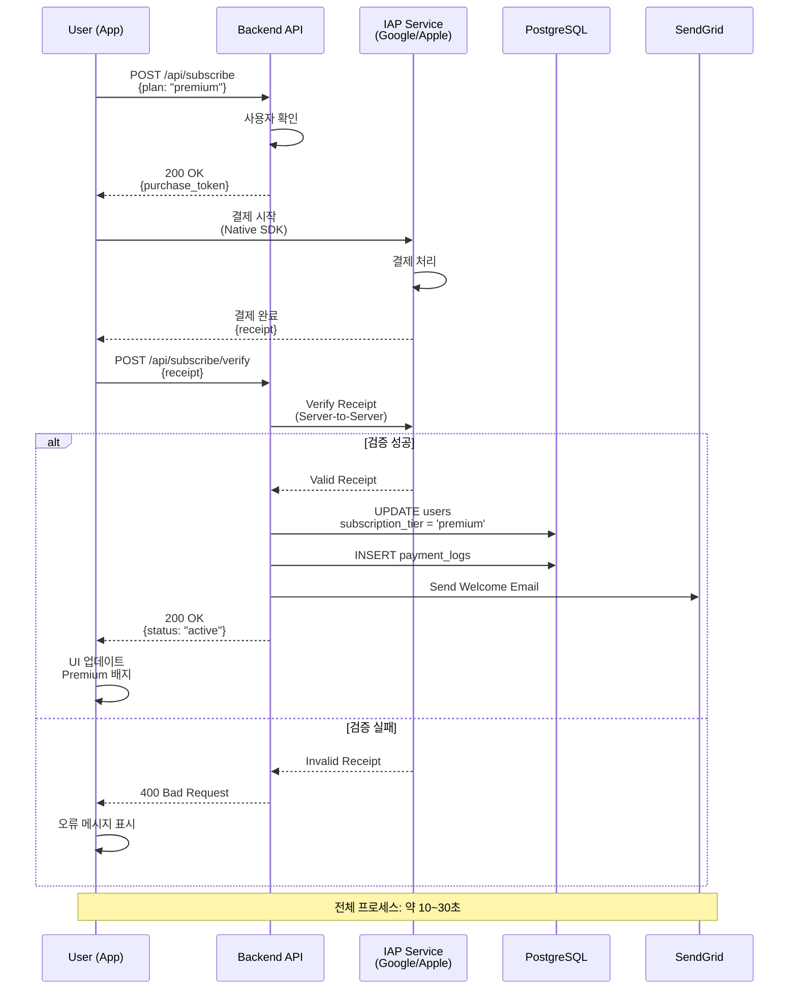
```mermaid
sequenceDiagram
    participant U as User (App)
    participant API as Backend API
    participant IAP as IAP Service<br/>(Google/Apple)
    participant DB as PostgreSQL
    participant Email as SendGrid
    
    U->>API: POST /api/subscribe<br/>{plan: "premium"}
    API->>API: 사용자 확인
    API-->>U: 200 OK<br/>{purchase_token}
    U->>IAP: 결제 시작<br/>(Native SDK)
    IAP->>IAP: 결제 처리
    IAP-->>U: 결제 완료<br/>{receipt}
    U->>API: POST /api/subscribe/verify<br/>{receipt}
    API->>IAP: Verify Receipt<br/>(Server-to-Server)
    alt 검증 성공
        IAP-->>API: Valid Receipt
        API->>DB: UPDATE users<br/>subscription_tier = 'premium'
        API->>DB: INSERT payment_logs
        API->>Email: Send Welcome Email
        API-->>U: 200 OK<br/>{status: "active"}
        U->>U: UI 업데이트<br/>Premium 배지
    else 검증 실패
        IAP-->>API: Invalid Receipt
        API-->>U: 400 Bad Request
        U->>U: 오류 메시지 표시
    end
    
    Note over U,Email: 전체 프로세스: 약 10~30초
```

---

## 6. 상태 다이어그램

### 6.1 사용자 상태 다이어그램

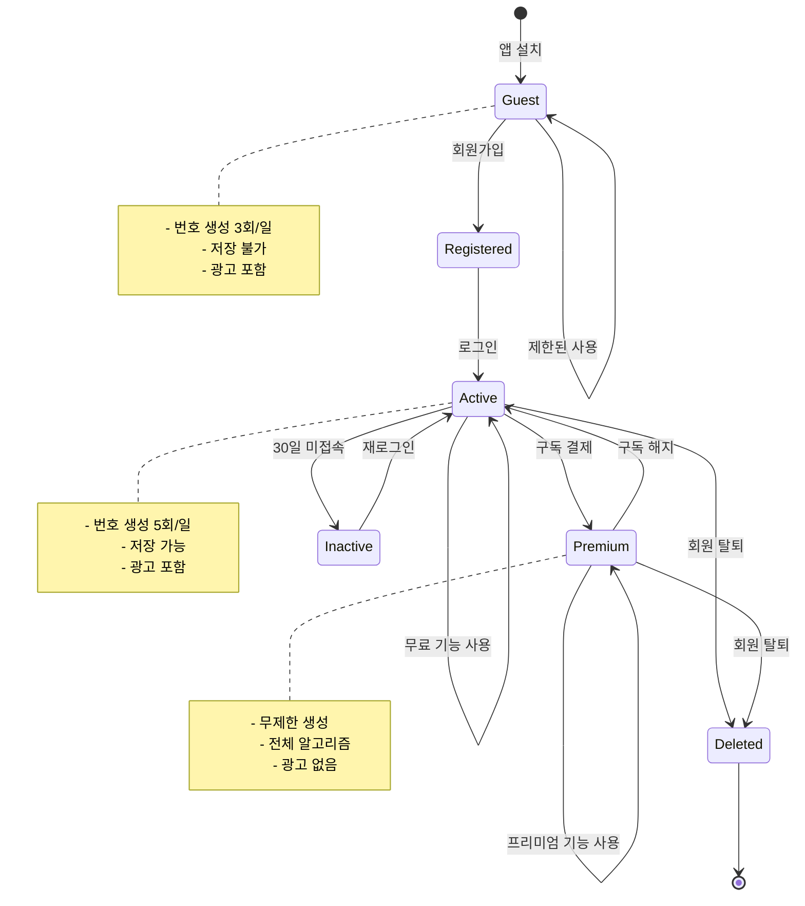
```mermaid
stateDiagram-v2
    [*] --> Guest: 앱 설치
    Guest --> Registered: 회원가입
    Guest --> Guest: 제한된 사용
    Registered --> Active: 로그인
    Active --> Premium: 구독 결제
    Active --> Active: 무료 기능 사용
    Premium --> Active: 구독 해지
    Premium --> Premium: 프리미엄 기능 사용
    Active --> Inactive: 30일 미접속
    Inactive --> Active: 재로그인
    Active --> Deleted: 회원 탈퇴
    Premium --> Deleted: 회원 탈퇴
    Deleted --> [*]
    
    note right of Guest
        - 번호 생성 3회/일
        - 저장 불가
        - 광고 포함
    end note
    
    note right of Active
        - 번호 생성 5회/일
        - 저장 가능
        - 광고 포함
    end note
    
    note right of Premium
        - 무제한 생성
        - 전체 알고리즘
        - 광고 없음
    end note
```

---

### 6.2 번호 생성 작업 상태

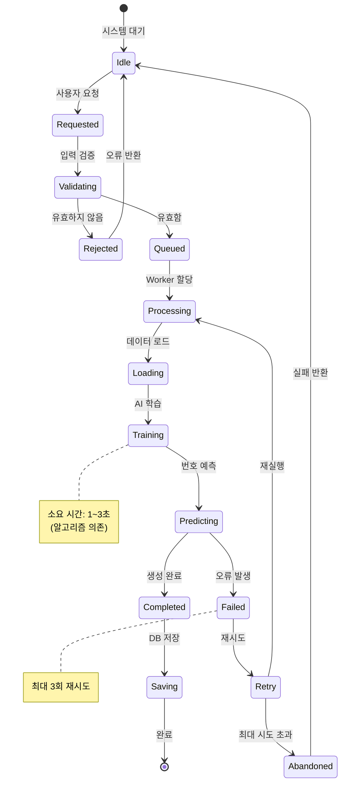
```mermaid
stateDiagram-v2
    [*] --> Idle: 시스템 대기
    Idle --> Requested: 사용자 요청
    Requested --> Validating: 입력 검증
    Validating --> Rejected: 유효하지 않음
    Validating --> Queued: 유효함
    Rejected --> Idle: 오류 반환
    Queued --> Processing: Worker 할당
    Processing --> Loading: 데이터 로드
    Loading --> Training: AI 학습
    Training --> Predicting: 번호 예측
    Predicting --> Completed: 생성 완료
    Predicting --> Failed: 오류 발생
    Failed --> Retry: 재시도
    Retry --> Processing: 재실행
    Retry --> Abandoned: 최대 시도 초과
    Abandoned --> Idle: 실패 반환
    Completed --> Saving: DB 저장
    Saving --> [*]: 완료
    
    note right of Training
        소요 시간: 1~3초
        (알고리즘 의존)
    end note
    
    note right of Failed
        최대 3회 재시도
    end note
```

---

### 6.3 크롤링 작업 상태

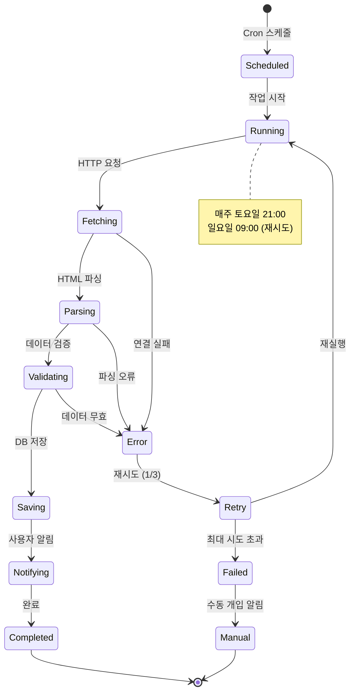
```mermaid
stateDiagram-v2
    [*] --> Scheduled: Cron 스케줄
    Scheduled --> Running: 작업 시작
    Running --> Fetching: HTTP 요청
    Fetching --> Parsing: HTML 파싱
    Parsing --> Validating: 데이터 검증
    Validating --> Saving: DB 저장
    Saving --> Notifying: 사용자 알림
    Notifying --> Completed: 완료
    Fetching --> Error: 연결 실패
    Parsing --> Error: 파싱 오류
    Validating --> Error: 데이터 무효
    Error --> Retry: 재시도 (1/3)
    Retry --> Running: 재실행
    Retry --> Failed: 최대 시도 초과
    Failed --> Manual: 수동 개입 알림
    Completed --> [*]
    Manual --> [*]
    
    note right of Running
        매주 토요일 21:00
        일요일 09:00 (재시도)
    end note
```

---

## 7. 시퀀스 다이어그램

### 7.1 번호 생성 전체 시퀀스

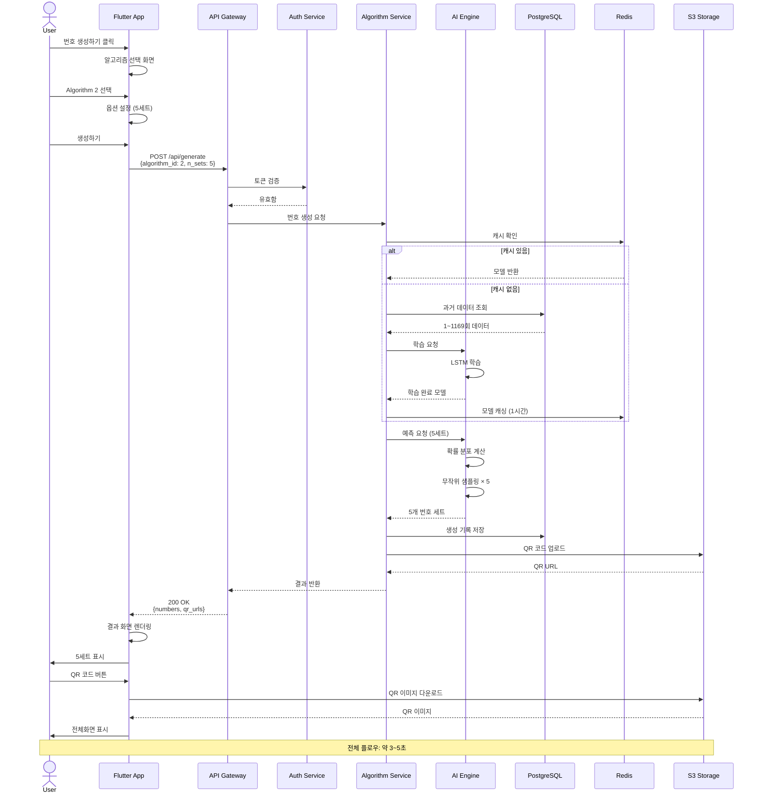
```mermaid
sequenceDiagram
    actor User
    participant App as Flutter App
    participant Gateway as API Gateway
    participant Auth as Auth Service
    participant Algo as Algorithm Service
    participant AI as AI Engine
    participant DB as PostgreSQL
    participant Cache as Redis
    participant S3 as S3 Storage
    
    User->>App: 번호 생성하기 클릭
    App->>App: 알고리즘 선택 화면
    User->>App: Algorithm 2 선택
    App->>App: 옵션 설정 (5세트)
    User->>App: 생성하기
    App->>Gateway: POST /api/generate<br/>{algorithm_id: 2, n_sets: 5}
    Gateway->>Auth: 토큰 검증
    Auth-->>Gateway: 유효함
    Gateway->>Algo: 번호 생성 요청
    Algo->>Cache: 캐시 확인
    alt 캐시 있음
        Cache-->>Algo: 모델 반환
    else 캐시 없음
        Algo->>DB: 과거 데이터 조회
        DB-->>Algo: 1~1169회 데이터
        Algo->>AI: 학습 요청
        AI->>AI: LSTM 학습
        AI-->>Algo: 학습 완료 모델
        Algo->>Cache: 모델 캐싱 (1시간)
    end
    Algo->>AI: 예측 요청 (5세트)
    AI->>AI: 확률 분포 계산
    AI->>AI: 무작위 샘플링 × 5
    AI-->>Algo: 5개 번호 세트
    Algo->>DB: 생성 기록 저장
    Algo->>S3: QR 코드 업로드
    S3-->>Algo: QR URL
    Algo-->>Gateway: 결과 반환
    Gateway-->>App: 200 OK<br/>{numbers, qr_urls}
    App->>App: 결과 화면 렌더링
    App->>User: 5세트 표시
    User->>App: QR 코드 버튼
    App->>S3: QR 이미지 다운로드
    S3-->>App: QR 이미지
    App->>User: 전체화면 표시
    
    Note over User,S3: 전체 플로우: 약 3~5초
```

---

### 7.2 당첨 확인 자동화 시퀀스

```mermaid
sequenceDiagram
    participant Scheduler as Celery Beat
    participant Worker as Celery Worker
    participant Web as 동행복권 Site
    participant DB as PostgreSQL
    participant FCM as Firebase FCM
    participant App as User App
    
    Note over Scheduler,App: 매주 토요일 21:00
    Scheduler->>Worker: 크롤링 작업 실행
    Worker->>Web: GET /gameResult.do?drwNo=1170
    Web-->>Worker: HTML Response
    Worker->>Worker: BeautifulSoup 파싱
    Worker->>Worker: 데이터 검증
    alt 검증 성공
        Worker->>DB: INSERT INTO lotto_draws<br/>VALUES (1170, 7, 13, 22, ...)
        DB-->>Worker: 저장 완료
    else 검증 실패
        Worker->>Worker: 재시도 (1/3)
        Worker->>Web: 재요청
    end
    Worker->>DB: SELECT * FROM generated_numbers<br/>WHERE draw_no = 1170
    DB-->>Worker: 사용자별 번호 리스트
    loop 각 사용자
        Worker->>Worker: 등수 판정<br/>judge_rank(predicted, winning)
        Worker->>DB: INSERT INTO winning_results<br/>VALUES (user_id, rank, ...)
        alt 3등 이상
            Worker->>FCM: 푸시 알림 발송<br/>"🎉 3등 당첨!"
            FCM->>App: Push Notification
            App->>App: 알림 표시
        else 5등
            Worker->>FCM: 푸시 알림 발송<br/>"5등 당첨 (5,000원)"
            FCM->>App: Push Notification
        else 꽝
            Note over Worker,App: 알림 설정에 따라<br/>선택적 발송
        end
    end
    Worker->>Scheduler: 작업 완료 보고
    
    Note over Scheduler,App: 전체 프로세스: 약 5~10분
```

---

### 7.3 알고리즘 검증 백테스팅 시퀀스

```mermaid
sequenceDiagram
    actor Dev as Developer
    participant Script as run_full_validation.py
    participant Validator as LottoValidator
    participant Algo as Algorithm Runner
    participant AI as LSTM Engine
    participant Eval as Evaluator
    participant DB as PostgreSQL
    participant File as CSV File
    
    Dev->>Script: python run_full_validation.py<br/>--algorithms 1,2,6
    Script->>Validator: 초기화
    Validator->>DB: 데이터 로드 (1~1169회)
    DB-->>Validator: DataFrame
    Validator->>Validator: 알고리즘 동적 로드
    
    loop 100회 → 1169회
        Note over Validator,File: 회차 N 검증
        Validator->>Validator: 과거 데이터 추출<br/>(1~N-1회)
        
        loop 알고리즘 1, 2, 6
            Validator->>Algo: generate_numbers<br/>(historical_data, n_sets=5)
            
            alt 알고리즘 1 (Random)
                Algo->>Algo: 무작위 샘플링
            else 알고리즘 2 (LSTM)
                Algo->>AI: 학습 요청
                AI->>AI: LSTM 학습
                AI-->>Algo: 모델
                Algo->>AI: 예측 요청
                AI-->>Algo: 확률 분포
                Algo->>Algo: 샘플링
            else 알고리즘 6 (Frequency)
                Algo->>Algo: 빈도 계산
                Algo->>Algo: 샘플링
            end
            
            Algo-->>Validator: 5세트 번호
            
            loop 5세트
                Validator->>DB: 실제 당첨번호 조회<br/>(N회차)
                DB-->>Validator: winning_numbers
                Validator->>Eval: judge_rank<br/>(predicted, winning, bonus)
                Eval->>Eval: 등수 판정
                Eval-->>Validator: rank, matched_count
                Validator->>File: CSV 기록
            end
        end
        
        Note over Validator: 진행률: N/1070
    end
    
    Validator->>Eval: calculate_aggregate_metrics
    Eval-->>Validator: 통계 결과
    Validator->>File: 리포트 생성 (HTML)
    Validator-->>Script: 검증 완료
    Script->>Dev: ✅ 완료 메시지
    
    Note over Dev,File: 전체 소요 시간: 30분~2시간
```

---

## 📎 부록

### A. 다이어그램 범례

**색상 코드**
- 🟦 파랑 (#667eea): 메인 프로세스
- 🟪 보라 (#764ba2): 중요 단계
- 🟩 초록 (#10b981): 성공/완료
- 🟨 주황 (#f59e0b): 경고/대기
- 🟥 빨강 (#ef4444): 오류/실패

**화살표 유형**
- → : 동기 호출
- -->> : 비동기 반환
- =>> : 캐시/빠른 응답

---

### B. Mermaid 다이어그램 렌더링

이 문서의 모든 다이어그램은 Mermaid 문법을 사용합니다.

**렌더링 도구**:
- GitHub: 자동 렌더링
- VS Code: Markdown Preview Mermaid Support 확장
- 온라인: https://mermaid.live/

---

### C. 업데이트 이력

| 버전 | 날짜 | 작성자 | 변경 내용 |
|------|------|--------|----------|
| v1.0 | 2025-12-16 | AI Team | 초안 작성 |

---

**문서 끝 | 2025-12-16 작성**

> 💡 **Tip**: 이 플로우차트는 시스템 설계의 시각적 표현입니다. 실제 구현 시 참고하세요.

