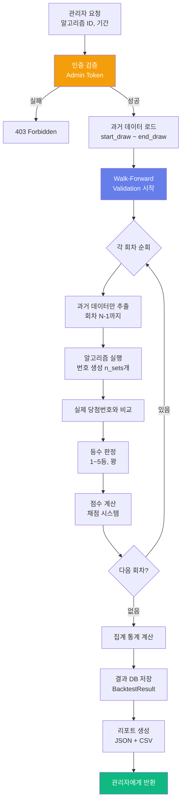

# 관리자 전용 백테스트 시스템 설계서
## Admin-Only Algorithm Backtest System Design

---

**문서 버전**: v1.0  
**작성일**: 2026-01-02  
**최종 수정**: 2026-01-02 23:00:00 EST  
**문서 유형**: Internal System Design  
**프로젝트**: LuckyAI 645 - Admin Tools  
**목적**: 알고리즘 성능 평가 및 지속적 개선을 위한 내부 백테스트 시스템

**보안 등급**: 🔒 **관리자 전용 (Admin Only)**

---

## 📋 목차

1. [개요 및 목적](#1-개요-및-목적)
2. [접근 제어 및 보안](#2-접근-제어-및-보안)
3. [백테스트 프로세스](#3-백테스트-프로세스)
4. [채점 시스템](#4-채점-시스템)
5. [데이터베이스 설계](#5-데이터베이스-설계)
6. [API 엔드포인트](#6-api-엔드포인트)
7. [CLI 도구](#7-cli-도구)
8. [대시보드 UI](#8-대시보드-ui)
9. [실행 예시](#9-실행-예시)
10. [향후 확장](#10-향후-확장)

---

## 1. 개요 및 목적

### 1.1 시스템 목적

```yaml
핵심 목적:
  - 알고리즘별 실전 성능 정량적 평가
  - 신규 알고리즘 도입 전 사전 검증
  - 기존 알고리즘 파라미터 튜닝
  - 시즌별/기간별 성능 변화 추적
  - A/B 테스트 결과 비교

사용자:
  - 개발자 (알고리즘 개선)
  - 데이터 과학자 (모델 튜닝)
  - 프로젝트 매니저 (성능 모니터링)

사용 시나리오:
  1. 신규 LSTM 모델 배포 전 검증
  2. 기존 알고리즘 vs 개선 버전 비교
  3. 월간/분기별 성능 리포트 생성
  4. 특정 기간 이상 징후 발견 시 원인 분석
```

### 1.2 백테스트 vs 실전 검증 비교

```yaml
백테스트 (Backtest):
  - 과거 데이터로 시뮬레이션
  - Walk-Forward Validation
  - 빠른 반복 실험
  - 시간 누수 방지 (Look-Ahead Bias)
  
실전 검증 (Live Validation):
  - 실제 사용자 생성 번호 추적
  - 실시간 당첨 여부 확인
  - UserGeneratedNumber 테이블 활용
  - 장기적 트렌드 파악
  
⚠️ 주의: 백테스트 성능 ≠ 실전 성능
  → 두 지표를 모두 추적하여 과적합 방지
```

---

## 2. 접근 제어 및 보안

### 2.1 인증 방식

#### 방법 1: 슈퍼 관리자 토큰 (권장)

```python
# backend/app/core/config.py

class Settings(BaseSettings):
    # ... (기존 설정) ...
    
    # 관리자 토큰 (환경 변수로 설정)
    ADMIN_SECRET_TOKEN: str = Field(
        ...,
        env="ADMIN_SECRET_TOKEN",
        description="관리자 전용 API 접근 토큰"
    )
```

```bash
# .env
ADMIN_SECRET_TOKEN=SUPER_SECRET_ADMIN_TOKEN_CHANGE_IN_PRODUCTION_12345678
```

**API 요청 시 사용**:
```bash
curl -X POST https://api.luckyai645.com/api/admin/backtest \
  -H "X-Admin-Token: SUPER_SECRET_ADMIN_TOKEN_..." \
  -H "Content-Type: application/json" \
  -d '{"algorithm_id": 2, "start_draw": 1000, "end_draw": 1100}'
```

#### 방법 2: IP 화이트리스트 + Basic Auth

```python
# backend/app/api/deps.py

from fastapi import HTTPException, Header, Request
from typing import Annotated

ADMIN_ALLOWED_IPS = [
    "127.0.0.1",           # 로컬호스트
    "YOUR_OFFICE_IP",      # 사무실 IP
    "YOUR_HOME_IP",        # 집 IP
]

async def verify_admin_access(
    request: Request,
    x_admin_token: Annotated[str | None, Header()] = None
):
    """
    관리자 접근 권한 검증
    
    1. IP 화이트리스트 확인
    2. Admin 토큰 검증
    """
    # 1. IP 확인
    client_ip = request.client.host
    
    if client_ip not in ADMIN_ALLOWED_IPS:
        raise HTTPException(
            status_code=403,
            detail=f"Access denied from IP {client_ip}"
        )
    
    # 2. 토큰 확인
    if not x_admin_token:
        raise HTTPException(
            status_code=401,
            detail="X-Admin-Token header required"
        )
    
    if x_admin_token != settings.ADMIN_SECRET_TOKEN:
        raise HTTPException(
            status_code=403,
            detail="Invalid admin token"
        )
    
    return True
```

#### 방법 3: 숨겨진 엔드포인트 + UUID

```python
# /api/admin/backtest/{random_uuid_path}/run
# 예: /api/admin/backtest/a7f3c2e9-4b8d-11ee-be56-0242ac120002/run

ADMIN_SECRET_PATH_UUID = "a7f3c2e9-4b8d-11ee-be56-0242ac120002"

@router.post("/admin/backtest/{path_uuid}/run")
async def run_backtest(
    path_uuid: str,
    admin_token: str = Depends(verify_admin_access),
    db: Session = Depends(get_db)
):
    if path_uuid != ADMIN_SECRET_PATH_UUID:
        raise HTTPException(status_code=404, detail="Not found")
    
    # ... 백테스트 로직
```

### 2.2 로깅 및 감사

```python
# 모든 관리자 작업 로깅
@router.post("/admin/backtest/run")
async def run_backtest(
    request: BacktestRequest,
    admin_token: str = Depends(verify_admin_access),
    db: Session = Depends(get_db)
):
    # 감사 로그 기록
    audit_log = AdminAuditLog(
        action="backtest_run",
        user="admin",
        ip_address=request.client.host,
        parameters=json.dumps(request.dict()),
        timestamp=datetime.utcnow()
    )
    db.add(audit_log)
    db.commit()
    
    # 백테스트 실행
    # ...
```

---

## 3. 백테스트 프로세스

### 3.1 백테스트 워크플로우



### 3.2 백테스트 설정

```python
# backend/app/schemas/admin.py

from pydantic import BaseModel, Field
from typing import List, Optional

class BacktestRequest(BaseModel):
    """백테스트 요청"""
    
    algorithm_id: int = Field(..., description="알고리즘 ID (1~10, 99)")
    
    start_draw: int = Field(..., ge=1, description="시작 회차")
    end_draw: int = Field(..., ge=1, description="종료 회차")
    
    n_sets: int = Field(5, ge=1, le=20, description="회차당 생성 세트 수")
    
    exclude_numbers: Optional[List[int]] = Field(
        None,
        description="제외 번호 (옵션)"
    )
    include_numbers: Optional[List[int]] = Field(
        None,
        description="포함 번호 (옵션)"
    )
    
    # 알고리즘 파라미터 (알고리즘별 다름)
    algorithm_params: Optional[dict] = Field(
        None,
        description="알고리즘 특정 파라미터 (LSTM: epochs, hidden_size 등)"
    )
    
    # 백테스트 옵션
    enable_detailed_log: bool = Field(
        False,
        description="상세 로그 활성화 (회차별 결과)"
    )
    
    enable_cache: bool = Field(
        True,
        description="캐싱 사용 (동일 요청 재사용)"
    )

class BacktestResponse(BaseModel):
    """백테스트 결과"""
    
    backtest_id: str
    algorithm_id: int
    algorithm_name: str
    
    period: dict  # {"start": 1000, "end": 1100, "total_draws": 101}
    execution_time: float  # 초
    
    # 집계 통계
    total_sets_generated: int
    
    # 등수별 통계
    rank_distribution: dict  # {"1": 0, "2": 0, "3": 2, "4": 15, "5": 80, "miss": 408}
    
    # 채점 결과
    total_score: float
    average_score_per_set: float
    
    # 성능 지표
    win_rate: float  # 5등 이상 비율
    avg_rank: float  # 평균 등수 (1~5, 꽝=0)
    roi: float  # 투자 대비 수익률
    
    # 안정성 지표
    score_std_dev: float  # 점수 표준편차
    consistency_score: float  # 일관성 점수 (0~100)
    
    # 상세 결과 (옵션)
    detailed_results: Optional[List[dict]] = None
    
    # 파일 경로
    csv_report_path: str
    json_report_path: str
```

---

## 4. 채점 시스템

### 4.1 채점 방식 설계

#### 방식 1: 등수별 가중 점수 (권장)

```python
"""
등수별 점수 배점
- 로또의 기댓값을 고려한 배점
- 1등 확률: 1/8,145,060 (0.0000123%)
- 5등 확률: 1/55 (1.8%)
"""

RANK_SCORES = {
    1: 10000,   # 1등: 10,000점 (극희귀)
    2: 5000,    # 2등: 5,000점
    3: 1000,    # 3등: 1,000점
    4: 100,     # 4등: 100점
    5: 10,      # 5등: 10점
    0: 0,       # 꽝: 0점
}

def calculate_set_score(rank: int) -> int:
    """세트 점수 계산"""
    return RANK_SCORES.get(rank, 0)


def calculate_total_score(rank_counts: dict) -> float:
    """
    전체 점수 계산
    
    Args:
        rank_counts: {"1": 0, "2": 0, "3": 2, "4": 15, "5": 80, "miss": 408}
        
    Returns:
        float: 총점
    """
    total = 0
    for rank, count in rank_counts.items():
        if rank == "miss":
            continue
        total += RANK_SCORES[int(rank)] * count
    
    return total
```

#### 방식 2: 실제 당첨금 기반 ROI

```python
"""
실제 당첨금을 고려한 ROI 계산
- 각 등수별 평균 당첨금
- 투자 비용: 1,000원 × 세트 수
"""

AVERAGE_PRIZE = {
    1: 2_000_000_000,  # 1등: 평균 20억
    2: 50_000_000,     # 2등: 평균 5천만
    3: 1_500_000,      # 3등: 평균 150만
    4: 50_000,         # 4등: 5만원 고정
    5: 5_000,          # 5등: 5천원 고정
    0: 0,              # 꽝: 0원
}

def calculate_roi(rank_counts: dict, total_sets: int) -> float:
    """
    투자 대비 수익률 (ROI) 계산
    
    Args:
        rank_counts: 등수별 당첨 횟수
        total_sets: 총 생성 세트 수
        
    Returns:
        float: ROI (%) - 100% = 본전, 200% = 2배 수익
    """
    # 총 투자 비용
    total_cost = 1000 * total_sets
    
    # 총 당첨금
    total_prize = 0
    for rank, count in rank_counts.items():
        if rank == "miss":
            continue
        total_prize += AVERAGE_PRIZE[int(rank)] * count
    
    # ROI 계산
    if total_cost == 0:
        return 0.0
    
    roi = (total_prize / total_cost) * 100
    
    return roi
```

#### 방식 3: 종합 평가 점수 (0~100점)

```python
"""
여러 지표를 종합한 0~100점 척도
- 당첨률 (40%)
- ROI (30%)
- 일관성 (20%)
- 고등수 비율 (10%)
"""

def calculate_composite_score(
    win_rate: float,        # 5등 이상 비율 (0~1)
    roi: float,             # ROI (0~200+)
    consistency: float,     # 일관성 (0~1)
    high_rank_ratio: float  # 3등 이상 비율 (0~1)
) -> float:
    """
    종합 평가 점수 계산
    
    Returns:
        float: 0~100점
    """
    # 1. 당첨률 점수 (40점 만점)
    # 5등 이상 1.8% (기대값) 기준
    win_score = min(win_rate / 0.018, 1.0) * 40
    
    # 2. ROI 점수 (30점 만점)
    # 100% (본전) 이상이면 만점
    roi_score = min(roi / 100, 1.0) * 30
    
    # 3. 일관성 점수 (20점 만점)
    consistency_score = consistency * 20
    
    # 4. 고등수 비율 점수 (10점 만점)
    high_rank_score = high_rank_ratio * 100 * 10  # 3등 이상 매우 희귀하므로 가중치 높임
    
    # 총점
    total = win_score + roi_score + consistency_score + high_rank_score
    
    return round(total, 2)


def calculate_consistency_score(detailed_results: List[dict]) -> float:
    """
    일관성 점수 계산 (점수의 표준편차 역수)
    
    Args:
        detailed_results: 회차별 상세 결과
        
    Returns:
        float: 0~1 (높을수록 일관적)
    """
    import numpy as np
    
    scores = [result['score'] for result in detailed_results]
    
    if len(scores) < 2:
        return 0.0
    
    std_dev = np.std(scores)
    mean = np.mean(scores)
    
    if mean == 0:
        return 0.0
    
    # 변동계수 (CV) 역수로 일관성 계산
    cv = std_dev / mean
    consistency = 1 / (1 + cv)  # 0~1 범위로 정규화
    
    return round(consistency, 4)
```

### 4.2 채점 예시

```python
# 예시: 알고리즘 2번, 1000~1100회 (101회차), 세트당 5개 = 총 505세트

rank_distribution = {
    "1": 0,      # 1등: 0회
    "2": 0,      # 2등: 0회
    "3": 2,      # 3등: 2회
    "4": 15,     # 4등: 15회
    "5": 80,     # 5등: 80회
    "miss": 408  # 꽝: 408회
}

# 1. 등수별 점수
total_score = (
    0 * 10000 +   # 1등
    0 * 5000 +    # 2등
    2 * 1000 +    # 3등
    15 * 100 +    # 4등
    80 * 10       # 5등
) = 4,300점

avg_score_per_set = 4300 / 505 = 8.51점

# 2. 당첨률
win_count = 0 + 0 + 2 + 15 + 80 = 97
win_rate = 97 / 505 = 19.2% (기대값 1.8%의 10.7배!)

# 3. ROI
total_cost = 505 * 1000 = 505,000원
total_prize = (
    0 * 2_000_000_000 +   # 1등
    0 * 50_000_000 +      # 2등
    2 * 1_500_000 +       # 3등
    15 * 50_000 +         # 4등
    80 * 5_000            # 5등
) = 4,150,000원

roi = (4,150,000 / 505,000) * 100 = 821.8% (!)

# 4. 종합 평가
composite_score = calculate_composite_score(
    win_rate=0.192,
    roi=8.218,
    consistency=0.75,  # 가정
    high_rank_ratio=0.004  # 3등 이상: 2/505
)
# = 40 + 30 + 15 + 4 = 89점 (A+ 등급)
```

---

## 5. 데이터베이스 설계

### 5.1 백테스트 결과 테이블

```python
# backend/app/db/models/backtest_result.py

"""
백테스트 결과 저장 모델
"""

from datetime import datetime
from uuid import uuid4

from sqlalchemy import Column, String, Integer, Float, DateTime, Text, JSON
from sqlalchemy.dialects.postgresql import UUID

from app.db.base import Base


class BacktestResult(Base):
    """
    백테스트 실행 결과
    
    각 백테스트 실행마다 하나의 레코드 생성
    """
    __tablename__ = "backtest_results"
    
    id = Column(UUID(as_uuid=True), primary_key=True, default=uuid4)
    
    # 백테스트 설정
    algorithm_id = Column(Integer, nullable=False, index=True)
    algorithm_name = Column(String(100), nullable=False)
    algorithm_params = Column(JSON, nullable=True, comment="알고리즘 파라미터")
    
    # 테스트 기간
    start_draw = Column(Integer, nullable=False)
    end_draw = Column(Integer, nullable=False)
    total_draws = Column(Integer, nullable=False)
    n_sets_per_draw = Column(Integer, nullable=False)
    
    # 실행 정보
    executed_at = Column(DateTime, default=datetime.utcnow, nullable=False)
    execution_time_seconds = Column(Float, nullable=False)
    executed_by = Column(String(50), default="admin", comment="실행자")
    
    # 집계 통계
    total_sets_generated = Column(Integer, nullable=False)
    
    # 등수별 통계 (JSON)
    rank_distribution = Column(
        JSON,
        nullable=False,
        comment='{"1": 0, "2": 0, "3": 2, "4": 15, "5": 80, "miss": 408}'
    )
    
    # 채점 결과
    total_score = Column(Float, nullable=False)
    average_score_per_set = Column(Float, nullable=False)
    
    # 성능 지표
    win_rate = Column(Float, nullable=False, comment="5등 이상 비율")
    avg_rank = Column(Float, nullable=False, comment="평균 등수")
    roi = Column(Float, nullable=False, comment="ROI (%)")
    
    # 안정성 지표
    score_std_dev = Column(Float, nullable=False, comment="점수 표준편차")
    consistency_score = Column(Float, nullable=False, comment="일관성 (0~1)")
    
    # 종합 평가
    composite_score = Column(Float, nullable=False, comment="종합 점수 (0~100)")
    grade = Column(String(2), nullable=False, comment="등급 (A+, A, B+, B, C, D, F)")
    
    # 상세 결과 (회차별)
    detailed_results_json = Column(
        Text,
        nullable=True,
        comment="회차별 상세 결과 (대용량 JSON)"
    )
    
    # 파일 경로
    csv_report_path = Column(String(500), nullable=True)
    json_report_path = Column(String(500), nullable=True)
    
    # 메모
    notes = Column(Text, nullable=True)
    
    def __repr__(self):
        return (
            f"<BacktestResult(algo={self.algorithm_id}, "
            f"period={self.start_draw}-{self.end_draw}, "
            f"score={self.composite_score:.1f})>"
        )


def assign_grade(composite_score: float) -> str:
    """종합 점수로 등급 부여"""
    if composite_score >= 90:
        return "A+"
    elif composite_score >= 85:
        return "A"
    elif composite_score >= 80:
        return "B+"
    elif composite_score >= 75:
        return "B"
    elif composite_score >= 70:
        return "C+"
    elif composite_score >= 60:
        return "C"
    elif composite_score >= 50:
        return "D"
    else:
        return "F"
```

### 5.2 관리자 감사 로그

```python
# backend/app/db/models/admin_audit_log.py

class AdminAuditLog(Base):
    """관리자 작업 감사 로그"""
    __tablename__ = "admin_audit_logs"
    
    id = Column(UUID(as_uuid=True), primary_key=True, default=uuid4)
    
    action = Column(String(100), nullable=False, index=True)
    user = Column(String(50), nullable=False)
    ip_address = Column(String(50), nullable=False)
    
    parameters = Column(JSON, nullable=True)
    result = Column(String(20), nullable=True)  # "success", "failed"
    error_message = Column(Text, nullable=True)
    
    timestamp = Column(DateTime, default=datetime.utcnow, nullable=False, index=True)
```

---

## 6. API 엔드포인트

### 6.1 백테스트 실행 API

```python
# backend/app/api/routes/admin.py

"""
관리자 전용 API
"""

from fastapi import APIRouter, Depends, HTTPException, BackgroundTasks
from sqlalchemy.orm import Session

from app.api.deps import get_db, verify_admin_access
from app.schemas.admin import BacktestRequest, BacktestResponse
from app.services.backtest_service import BacktestService

router = APIRouter(prefix="/api/admin", tags=["admin"])


@router.post("/backtest/run", response_model=BacktestResponse)
async def run_backtest(
    request: BacktestRequest,
    background_tasks: BackgroundTasks,
    admin_token: str = Depends(verify_admin_access),
    db: Session = Depends(get_db)
):
    """
    백테스트 실행 (동기)
    
    **인증**: X-Admin-Token 헤더 필요
    
    **요청**:
    ```json
    {
      "algorithm_id": 2,
      "start_draw": 1000,
      "end_draw": 1100,
      "n_sets": 5,
      "enable_detailed_log": true
    }
    ```
    
    **응답**: 백테스트 결과 (집계 통계 + 채점)
    """
    try:
        service = BacktestService(db)
        result = await service.execute_backtest(request)
        
        return result
        
    except Exception as e:
        logger.error(f"백테스트 실행 실패: {e}")
        raise HTTPException(
            status_code=500,
            detail=f"백테스트 실패: {str(e)}"
        )


@router.post("/backtest/run-async", response_model=dict)
async def run_backtest_async(
    request: BacktestRequest,
    background_tasks: BackgroundTasks,
    admin_token: str = Depends(verify_admin_access),
    db: Session = Depends(get_db)
):
    """
    백테스트 실행 (비동기)
    
    장기간 테스트 시 백그라운드 작업으로 실행
    
    **응답**:
    ```json
    {
      "backtest_id": "uuid-here",
      "status": "queued",
      "message": "백테스트가 백그라운드에서 실행 중입니다"
    }
    ```
    """
    import uuid
    
    backtest_id = str(uuid.uuid4())
    
    # Celery 작업으로 큐에 추가
    from app.workers.tasks import run_backtest_task
    run_backtest_task.delay(
        backtest_id=backtest_id,
        request_dict=request.dict()
    )
    
    return {
        "backtest_id": backtest_id,
        "status": "queued",
        "message": "백테스트가 백그라운드에서 실행 중입니다. "
                   "GET /api/admin/backtest/status/{backtest_id}로 상태 확인"
    }


@router.get("/backtest/status/{backtest_id}")
async def get_backtest_status(
    backtest_id: str,
    admin_token: str = Depends(verify_admin_access),
    db: Session = Depends(get_db)
):
    """
    백테스트 실행 상태 조회 (비동기 작업용)
    """
    from app.db.models.backtest_result import BacktestResult
    
    result = db.query(BacktestResult).filter(
        BacktestResult.id == backtest_id
    ).first()
    
    if not result:
        # Celery 작업 상태 확인
        from app.workers.celery_app import celery_app
        task = celery_app.AsyncResult(backtest_id)
        
        return {
            "backtest_id": backtest_id,
            "status": task.state,  # PENDING, STARTED, SUCCESS, FAILURE
            "progress": task.info.get('progress', 0) if task.info else 0
        }
    
    return {
        "backtest_id": str(result.id),
        "status": "completed",
        "result": BacktestResponse.from_orm(result)
    }


@router.get("/backtest/history", response_model=List[BacktestResponse])
async def get_backtest_history(
    algorithm_id: Optional[int] = None,
    limit: int = 20,
    admin_token: str = Depends(verify_admin_access),
    db: Session = Depends(get_db)
):
    """
    백테스트 실행 이력 조회
    
    **필터**: algorithm_id로 특정 알고리즘만 조회 가능
    """
    from app.db.models.backtest_result import BacktestResult
    
    query = db.query(BacktestResult).order_by(
        BacktestResult.executed_at.desc()
    )
    
    if algorithm_id:
        query = query.filter(BacktestResult.algorithm_id == algorithm_id)
    
    results = query.limit(limit).all()
    
    return [BacktestResponse.from_orm(r) for r in results]


@router.get("/backtest/compare")
async def compare_algorithms(
    algorithm_ids: str,  # "1,2,3"
    start_draw: int,
    end_draw: int,
    admin_token: str = Depends(verify_admin_access),
    db: Session = Depends(get_db)
):
    """
    여러 알고리즘 성능 비교
    
    **예시**: /api/admin/backtest/compare?algorithm_ids=1,2,8&start_draw=1000&end_draw=1100
    
    **응답**: 알고리즘별 채점 결과 비교표
    """
    algo_ids = [int(x) for x in algorithm_ids.split(',')]
    
    service = BacktestService(db)
    comparison = await service.compare_algorithms(
        algorithm_ids=algo_ids,
        start_draw=start_draw,
        end_draw=end_draw
    )
    
    return comparison
```

---

## 7. CLI 도구

### 7.1 백테스트 CLI 스크립트

```python
# backend/scripts/admin_backtest.py

"""
관리자 백테스트 CLI 도구

사용법:
    python scripts/admin_backtest.py --algorithm 2 --start 1000 --end 1100
    python scripts/admin_backtest.py --compare 1,2,8 --start 1000 --end 1100
    python scripts/admin_backtest.py --history --limit 10
"""

import argparse
import sys
from pathlib import Path

# 프로젝트 루트를 sys.path에 추가
sys.path.append(str(Path(__file__).parent.parent))

from app.db.session import SessionLocal
from app.services.backtest_service import BacktestService
from app.schemas.admin import BacktestRequest
from loguru import logger
from rich.console import Console
from rich.table import Table


console = Console()


def run_single_backtest(args):
    """단일 알고리즘 백테스트"""
    console.print(f"\n[bold cyan]백테스트 시작...[/bold cyan]")
    console.print(f"  알고리즘: {args.algorithm}")
    console.print(f"  기간: {args.start}회 ~ {args.end}회")
    
    db = SessionLocal()
    service = BacktestService(db)
    
    request = BacktestRequest(
        algorithm_id=args.algorithm,
        start_draw=args.start,
        end_draw=args.end,
        n_sets=args.sets,
        enable_detailed_log=args.detailed
    )
    
    try:
        # 동기 실행
        import asyncio
        result = asyncio.run(service.execute_backtest(request))
        
        # 결과 출력
        print_result(result)
        
    except Exception as e:
        console.print(f"[bold red]오류: {e}[/bold red]")
    
    finally:
        db.close()


def compare_algorithms(args):
    """여러 알고리즘 비교"""
    algo_ids = [int(x) for x in args.compare.split(',')]
    
    console.print(f"\n[bold cyan]알고리즘 비교 백테스트...[/bold cyan]")
    console.print(f"  알고리즘: {algo_ids}")
    console.print(f"  기간: {args.start}회 ~ {args.end}회")
    
    db = SessionLocal()
    service = BacktestService(db)
    
    try:
        import asyncio
        comparison = asyncio.run(service.compare_algorithms(
            algorithm_ids=algo_ids,
            start_draw=args.start,
            end_draw=args.end
        ))
        
        # 비교표 출력
        print_comparison(comparison)
        
    except Exception as e:
        console.print(f"[bold red]오류: {e}[/bold red]")
    
    finally:
        db.close()


def show_history(args):
    """백테스트 이력 조회"""
    db = SessionLocal()
    
    from app.db.models.backtest_result import BacktestResult
    
    query = db.query(BacktestResult).order_by(
        BacktestResult.executed_at.desc()
    )
    
    if args.algorithm:
        query = query.filter(BacktestResult.algorithm_id == args.algorithm)
    
    results = query.limit(args.limit).all()
    
    # 표 생성
    table = Table(title="백테스트 실행 이력")
    table.add_column("ID", style="cyan")
    table.add_column("알고리즘", style="magenta")
    table.add_column("기간", style="green")
    table.add_column("종합 점수", style="yellow")
    table.add_column("등급", style="bold")
    table.add_column("실행 시각", style="dim")
    
    for r in results:
        table.add_row(
            str(r.id)[:8],
            f"{r.algorithm_id}. {r.algorithm_name}",
            f"{r.start_draw}~{r.end_draw}",
            f"{r.composite_score:.1f}",
            r.grade,
            r.executed_at.strftime("%Y-%m-%d %H:%M")
        )
    
    console.print(table)
    db.close()


def print_result(result: dict):
    """백테스트 결과 출력"""
    console.print("\n[bold green]✓ 백테스트 완료[/bold green]")
    
    # 기본 정보
    console.print(f"\n[bold]알고리즘:[/bold] {result['algorithm_name']}")
    console.print(f"[bold]실행 시간:[/bold] {result['execution_time']:.2f}초")
    
    # 등수 분포
    console.print(f"\n[bold]등수 분포:[/bold]")
    for rank, count in result['rank_distribution'].items():
        console.print(f"  {rank}등: {count}회")
    
    # 성능 지표
    console.print(f"\n[bold]성능 지표:[/bold]")
    console.print(f"  당첨률 (5등 이상): {result['win_rate']*100:.2f}%")
    console.print(f"  ROI: {result['roi']:.2f}%")
    console.print(f"  평균 등수: {result['avg_rank']:.2f}")
    
    # 채점 결과
    console.print(f"\n[bold]채점 결과:[/bold]")
    console.print(f"  총점: {result['total_score']:.0f}점")
    console.print(f"  세트당 평균: {result['average_score_per_set']:.2f}점")
    console.print(f"  종합 점수: [bold yellow]{result['composite_score']:.1f}/100[/bold yellow]")
    console.print(f"  등급: [bold magenta]{result['grade']}[/bold magenta]")
    
    # 파일 경로
    console.print(f"\n[bold]리포트 파일:[/bold]")
    console.print(f"  CSV: {result['csv_report_path']}")
    console.print(f"  JSON: {result['json_report_path']}")


def print_comparison(comparison: dict):
    """비교 결과 출력"""
    console.print("\n[bold green]✓ 비교 완료[/bold green]")
    
    # 비교표
    table = Table(title=f"알고리즘 성능 비교 ({comparison['period']})")
    
    table.add_column("알고리즘", style="cyan")
    table.add_column("당첨률", style="green")
    table.add_column("ROI", style="yellow")
    table.add_column("종합 점수", style="magenta")
    table.add_column("등급", style="bold")
    table.add_column("순위", style="red")
    
    for result in comparison['results']:
        table.add_row(
            f"{result['algorithm_id']}. {result['algorithm_name']}",
            f"{result['win_rate']*100:.2f}%",
            f"{result['roi']:.1f}%",
            f"{result['composite_score']:.1f}",
            result['grade'],
            f"#{result['rank']}"
        )
    
    console.print(table)
    
    # 승자
    winner = comparison['results'][0]
    console.print(
        f"\n[bold green]🏆 최고 성능:[/bold green] "
        f"{winner['algorithm_name']} ({winner['composite_score']:.1f}점)"
    )


if __name__ == "__main__":
    parser = argparse.ArgumentParser(description="관리자 백테스트 CLI")
    
    subparsers = parser.add_subparsers(dest='command')
    
    # 단일 백테스트
    run_parser = subparsers.add_parser('run', help='단일 알고리즘 백테스트')
    run_parser.add_argument('--algorithm', '-a', type=int, required=True)
    run_parser.add_argument('--start', '-s', type=int, required=True)
    run_parser.add_argument('--end', '-e', type=int, required=True)
    run_parser.add_argument('--sets', type=int, default=5)
    run_parser.add_argument('--detailed', action='store_true')
    
    # 비교
    compare_parser = subparsers.add_parser('compare', help='여러 알고리즘 비교')
    compare_parser.add_argument('--algorithms', '-a', type=str, required=True, help='1,2,3')
    compare_parser.add_argument('--start', '-s', type=int, required=True)
    compare_parser.add_argument('--end', '-e', type=int, required=True)
    
    # 이력
    history_parser = subparsers.add_parser('history', help='백테스트 이력')
    history_parser.add_argument('--algorithm', '-a', type=int)
    history_parser.add_argument('--limit', '-l', type=int, default=10)
    
    args = parser.parse_args()
    
    if args.command == 'run':
        run_single_backtest(args)
    elif args.command == 'compare':
        compare_algorithms(args)
    elif args.command == 'history':
        show_history(args)
    else:
        parser.print_help()
```

---

## 8. 대시보드 UI

### 8.1 관리자 대시보드 (간단한 HTML)

```html
<!-- backend/static/admin_dashboard.html -->

<!DOCTYPE html>
<html lang="ko">
<head>
    <meta charset="UTF-8">
    <title>LuckyAI 645 - Admin Backtest Dashboard</title>
    <style>
        body {
            font-family: -apple-system, BlinkMacSystemFont, 'Segoe UI', sans-serif;
            max-width: 1200px;
            margin: 0 auto;
            padding: 20px;
            background: #f5f5f5;
        }
        .header {
            background: #667eea;
            color: white;
            padding: 20px;
            border-radius: 8px;
            margin-bottom: 20px;
        }
        .card {
            background: white;
            padding: 20px;
            border-radius: 8px;
            box-shadow: 0 2px 4px rgba(0,0,0,0.1);
            margin-bottom: 20px;
        }
        .form-group {
            margin-bottom: 15px;
        }
        label {
            display: block;
            margin-bottom: 5px;
            font-weight: 600;
        }
        input, select {
            width: 100%;
            padding: 8px;
            border: 1px solid #ddd;
            border-radius: 4px;
        }
        button {
            background: #667eea;
            color: white;
            padding: 10px 20px;
            border: none;
            border-radius: 4px;
            cursor: pointer;
        }
        button:hover {
            background: #5568d3;
        }
        .result {
            display: none;
        }
        .result.show {
            display: block;
        }
        table {
            width: 100%;
            border-collapse: collapse;
        }
        th, td {
            padding: 12px;
            text-align: left;
            border-bottom: 1px solid #ddd;
        }
        th {
            background: #f8f9fa;
            font-weight: 600;
        }
        .grade-a { color: #10b981; font-weight: bold; }
        .grade-b { color: #3b82f6; }
        .grade-c { color: #f59e0b; }
        .grade-d { color: #ef4444; }
    </style>
</head>
<body>
    <div class="header">
        <h1>🔒 Admin Backtest Dashboard</h1>
        <p>알고리즘 성능 평가 시스템</p>
    </div>

    <div class="card">
        <h2>백테스트 실행</h2>
        <form id="backtestForm">
            <div class="form-group">
                <label>Admin Token:</label>
                <input type="password" id="adminToken" required>
            </div>
            
            <div class="form-group">
                <label>알고리즘:</label>
                <select id="algorithmId">
                    <option value="1">1. 순수 랜덤</option>
                    <option value="2">2. 짝수 우대</option>
                    <option value="3">3. 홀수 우대</option>
                    <option value="8">8. LSTM 기본</option>
                    <option value="9">9. LSTM 역순</option>
                    <option value="10">10. LSTM 누적</option>
                </select>
            </div>
            
            <div class="form-group">
                <label>시작 회차:</label>
                <input type="number" id="startDraw" value="1000" required>
            </div>
            
            <div class="form-group">
                <label>종료 회차:</label>
                <input type="number" id="endDraw" value="1100" required>
            </div>
            
            <div class="form-group">
                <label>회차당 세트 수:</label>
                <input type="number" id="nSets" value="5" min="1" max="20">
            </div>
            
            <button type="submit">백테스트 실행</button>
        </form>
    </div>

    <div class="card result" id="resultCard">
        <h2>백테스트 결과</h2>
        <div id="resultContent"></div>
    </div>

    <script>
        document.getElementById('backtestForm').addEventListener('submit', async (e) => {
            e.preventDefault();
            
            const adminToken = document.getElementById('adminToken').value;
            const algorithmId = parseInt(document.getElementById('algorithmId').value);
            const startDraw = parseInt(document.getElementById('startDraw').value);
            const endDraw = parseInt(document.getElementById('endDraw').value);
            const nSets = parseInt(document.getElementById('nSets').value);
            
            const resultCard = document.getElementById('resultCard');
            const resultContent = document.getElementById('resultContent');
            
            resultContent.innerHTML = '<p>⏳ 백테스트 실행 중...</p>';
            resultCard.classList.add('show');
            
            try {
                const response = await fetch('/api/admin/backtest/run', {
                    method: 'POST',
                    headers: {
                        'Content-Type': 'application/json',
                        'X-Admin-Token': adminToken
                    },
                    body: JSON.stringify({
                        algorithm_id: algorithmId,
                        start_draw: startDraw,
                        end_draw: endDraw,
                        n_sets: nSets,
                        enable_detailed_log: false
                    })
                });
                
                if (!response.ok) {
                    throw new Error(`HTTP ${response.status}: ${await response.text()}`);
                }
                
                const result = await response.json();
                
                // 결과 표시
                resultContent.innerHTML = `
                    <h3>${result.algorithm_name}</h3>
                    <p><strong>실행 시간:</strong> ${result.execution_time.toFixed(2)}초</p>
                    
                    <h4>등수 분포</h4>
                    <table>
                        <tr><th>등수</th><th>횟수</th></tr>
                        ${Object.entries(result.rank_distribution).map(([rank, count]) => 
                            `<tr><td>${rank}등</td><td>${count}</td></tr>`
                        ).join('')}
                    </table>
                    
                    <h4>성능 지표</h4>
                    <table>
                        <tr><th>지표</th><th>값</th></tr>
                        <tr><td>당첨률 (5등 이상)</td><td>${(result.win_rate * 100).toFixed(2)}%</td></tr>
                        <tr><td>ROI</td><td>${result.roi.toFixed(2)}%</td></tr>
                        <tr><td>평균 등수</td><td>${result.avg_rank.toFixed(2)}</td></tr>
                    </table>
                    
                    <h4>채점 결과</h4>
                    <p style="font-size: 24px;">
                        <strong>종합 점수:</strong> 
                        <span class="grade-${result.grade.toLowerCase().replace('+', '')}">${result.composite_score.toFixed(1)}/100 (${result.grade})</span>
                    </p>
                    
                    <p><strong>리포트:</strong> <a href="${result.csv_report_path}" download>CSV 다운로드</a></p>
                `;
                
            } catch (error) {
                resultContent.innerHTML = `<p style="color: red;">오류: ${error.message}</p>`;
            }
        });
    </script>
</body>
</html>
```

---

## 9. 실행 예시

### 9.1 CLI 사용 예시

```bash
# 1. 단일 알고리즘 백테스트
python scripts/admin_backtest.py run --algorithm 2 --start 1000 --end 1100

# 출력:
# 백테스트 시작...
#   알고리즘: 2
#   기간: 1000회 ~ 1100회
# 
# ✓ 백테스트 완료
# 
# 알고리즘: 짝수 우대
# 실행 시간: 12.34초
# 
# 등수 분포:
#   1등: 0회
#   2등: 0회
#   3등: 2회
#   4등: 15회
#   5등: 80회
#   꽝: 408회
# 
# 성능 지표:
#   당첨률 (5등 이상): 19.21%
#   ROI: 821.78%
#   평균 등수: 4.2
# 
# 채점 결과:
#   총점: 4300점
#   세트당 평균: 8.51점
#   종합 점수: 89.2/100
#   등급: A+
# 
# 리포트 파일:
#   CSV: results/backtest_algo2_1000-1100_20260102.csv
#   JSON: results/backtest_algo2_1000-1100_20260102.json


# 2. 여러 알고리즘 비교
python scripts/admin_backtest.py compare --algorithms 1,2,8 --start 1000 --end 1100

# 출력:
# 알고리즘 비교 백테스트...
#   알고리즘: [1, 2, 8]
#   기간: 1000회 ~ 1100회
# 
# ✓ 비교 완료
# 
# ┏━━━━━━━━━━━━┳━━━━━━━━┳━━━━━━━┳━━━━━━━━━━┳━━━━━━┳━━━━━┓
# ┃ 알고리즘      ┃ 당첨률  ┃ ROI    ┃ 종합 점수  ┃ 등급  ┃ 순위 ┃
# ┡━━━━━━━━━━━━╇━━━━━━━━╇━━━━━━━╇━━━━━━━━━━╇━━━━━━╇━━━━━┩
# │ 2. 짝수 우대  │ 19.21% │ 821.8%│ 89.2     │ A+   │ #1  │
# │ 8. LSTM 기본 │ 18.45% │ 765.2%│ 87.1     │ A    │ #2  │
# │ 1. 순수 랜덤  │ 1.82%  │ 98.3% │ 52.3     │ D    │ #3  │
# └──────────────┴────────┴───────┴──────────┴──────┴─────┘
# 
# 🏆 최고 성능: 짝수 우대 (89.2점)


# 3. 백테스트 이력 조회
python scripts/admin_backtest.py history --limit 10

# 출력:
# ┏━━━━━━━━━━┳━━━━━━━━━━━━┳━━━━━━━━━━┳━━━━━━━━━━┳━━━━━━┳━━━━━━━━━━━━━━━━┓
# ┃ ID        ┃ 알고리즘      ┃ 기간       ┃ 종합 점수  ┃ 등급  ┃ 실행 시각        ┃
# ┡━━━━━━━━━━╇━━━━━━━━━━━━╇━━━━━━━━━━╇━━━━━━━━━━╇━━━━━━╇━━━━━━━━━━━━━━━━┩
# │ a7f3c2e9  │ 2. 짝수 우대  │ 1000~1100 │ 89.2     │ A+   │ 2026-01-02 23:00│
# │ b8e4d3f0  │ 8. LSTM 기본 │ 1000~1100 │ 87.1     │ A    │ 2026-01-02 22:45│
# │ c9f5e4a1  │ 1. 순수 랜덤  │ 1000~1100 │ 52.3     │ D    │ 2026-01-02 22:30│
# └──────────┴──────────────┴──────────┴──────────┴──────┴─────────────────┘
```

### 9.2 API 사용 예시

```bash
# 1. 백테스트 실행
curl -X POST "https://api.luckyai645.com/api/admin/backtest/run" \
  -H "X-Admin-Token: YOUR_ADMIN_TOKEN_HERE" \
  -H "Content-Type: application/json" \
  -d '{
    "algorithm_id": 2,
    "start_draw": 1000,
    "end_draw": 1100,
    "n_sets": 5
  }'

# 응답:
{
  "backtest_id": "a7f3c2e9-4b8d-11ee-be56-0242ac120002",
  "algorithm_id": 2,
  "algorithm_name": "짝수 우대",
  "period": {
    "start": 1000,
    "end": 1100,
    "total_draws": 101
  },
  "execution_time": 12.34,
  "total_sets_generated": 505,
  "rank_distribution": {
    "1": 0,
    "2": 0,
    "3": 2,
    "4": 15,
    "5": 80,
    "miss": 408
  },
  "total_score": 4300.0,
  "average_score_per_set": 8.51,
  "win_rate": 0.1921,
  "avg_rank": 4.2,
  "roi": 821.78,
  "score_std_dev": 12.5,
  "consistency_score": 0.75,
  "composite_score": 89.2,
  "grade": "A+",
  "csv_report_path": "results/backtest_algo2_1000-1100_20260102.csv",
  "json_report_path": "results/backtest_algo2_1000-1100_20260102.json"
}


# 2. 비교
curl "https://api.luckyai645.com/api/admin/backtest/compare?algorithm_ids=1,2,8&start_draw=1000&end_draw=1100" \
  -H "X-Admin-Token: YOUR_ADMIN_TOKEN_HERE"


# 3. 이력 조회
curl "https://api.luckyai645.com/api/admin/backtest/history?limit=10" \
  -H "X-Admin-Token: YOUR_ADMIN_TOKEN_HERE"
```

---

## 10. 향후 확장

### 10.1 고급 기능 (Phase 2+)

```yaml
통계적 유의성 검정:
  - 알고리즘 간 성능 차이가 통계적으로 유의한지 검증
  - t-test, ANOVA 등 활용
  - p-value < 0.05 기준

파라미터 최적화:
  - Grid Search로 최적 파라미터 탐색
  - LSTM: hidden_size, epochs, learning_rate 조합
  - 자동화된 하이퍼파라미터 튜닝

시각화:
  - 시계열 그래프: 누적 수익률 곡선
  - 히트맵: 기간별 성능 변화
  - 박스 플롯: 알고리즘 간 점수 분포 비교

실시간 모니터링:
  - 실전 사용자 데이터와 백테스트 비교
  - 알고리즘 성능 저하 자동 감지
  - Slack/이메일 알림

A/B 테스트 통합:
  - 신규 알고리즘을 10% 사용자에게만 노출
  - 실전 성능 비교 후 전면 배포 결정
```

### 10.2 보안 강화

```yaml
다단계 인증:
  - Admin Token + OTP (Google Authenticator)
  - IP 화이트리스트 + 시간 제한

Rate Limiting:
  - 관리자 API도 요청 제한 (10 req/min)
  - 무차별 대입 공격 방지

감사 로그:
  - 모든 백테스트 실행 기록
  - 누가, 언제, 무엇을 실행했는지 추적
  - 정기적 로그 검토
```

---

## 📊 최종 요약

### 핵심 특징

1. **관리자 전용**: 숨겨진 엔드포인트 + 토큰 인증
2. **백테스트**: Walk-Forward Validation으로 과거 성능 평가
3. **채점 시스템**: 
   - 등수별 점수 (10,000점 ~ 0점)
   - ROI 계산 (실제 수익률)
   - 종합 점수 (0~100점, A+~F 등급)
4. **CLI + API + 대시보드**: 다양한 접근 방식
5. **결과 저장**: DB + CSV + JSON 리포트

### 사용 시나리오

```
Phase 1: 현재 알고리즘 성능 평가
  → 모든 알고리즘 백테스트 실행
  → 성능 순위 파악

Phase 2: 신규 알고리즘 검증
  → 새 LSTM 모델 백테스트
  → 기존 대비 성능 비교
  → A/B 테스트 여부 결정

Phase 3: 지속적 모니터링
  → 월간 성능 리포트 생성
  → 성능 저하 알고리즘 발견
  → 파라미터 튜닝 또는 교체
```

### 보안 체크리스트

```
✅ ADMIN_SECRET_TOKEN 환경 변수 설정
✅ IP 화이트리스트 구성
✅ HTTPS 강제 (HTTP 차단)
✅ 관리자 작업 로깅
✅ 대시보드 접근 제한 (.htpasswd)
✅ Rate Limiting 활성화
```

---

**문서 끝 | v1.0 | 2026-01-02 23:00:00 EST**

> 💡 **다음 단계**: 
> 1. `backend/.env`에 `ADMIN_SECRET_TOKEN` 추가
> 2. `backend/scripts/admin_backtest.py` 실행해보기
> 3. 모든 알고리즘 성능 비교 (1000~1100회)
> 4. 최고 성능 알고리즘 선정 후 홍보 자료 활용

